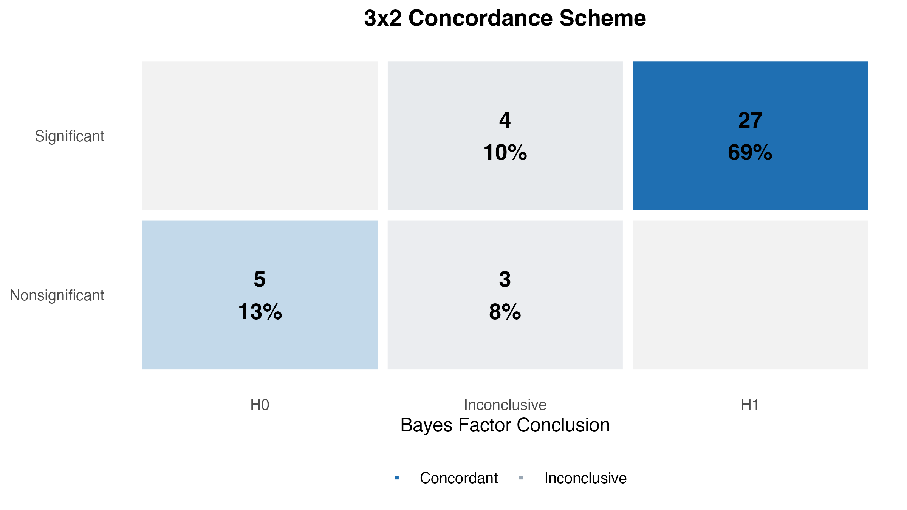
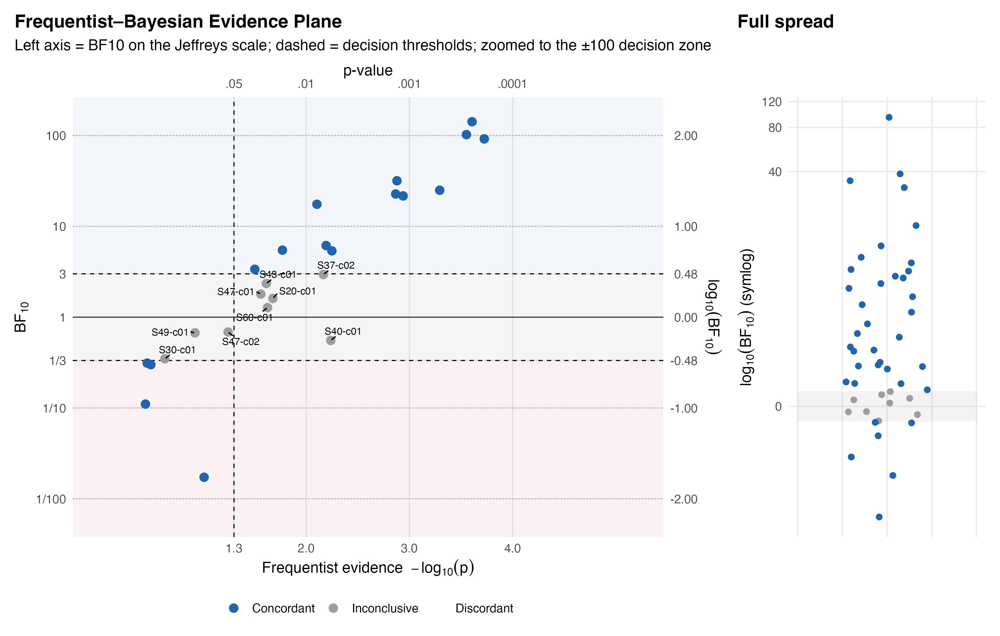
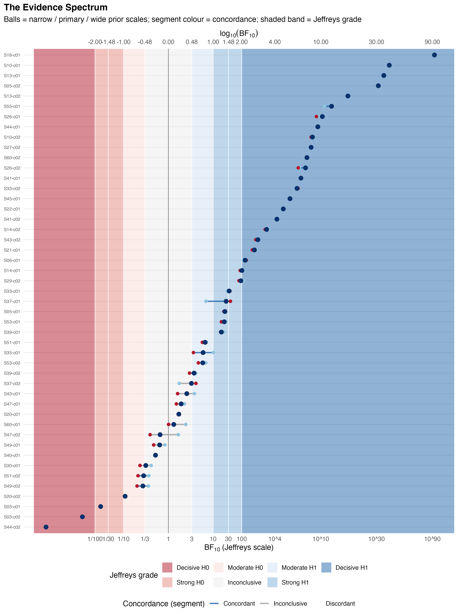

# Bayesian Reanalysis of Computationally Reproducible Studies in Psychology

This repository contains a reproducible Bayesian reanalysis of frequentist results from studies in the psychology of teaching and education. It starts from results that have already been computationally reproduced, and asks a separate question: does the *evidential verdict* survive a Bayesian re-evaluation?

The project separates:

1. extraction and registration of published claims;
2. frequentist reproduction or recomputation;
3. Bayesian reanalysis (three "waves" of increasing design complexity);
4. frequentist–Bayesian concordance classification;
5. prior-sensitivity and numerical-stability auditing;
6. tables, figures, and reporting outputs.

The repository is organised so that every claim marked `ready` can be reproduced from the prepared study data committed under `data/raw/`, the locked R environment, and a single run-all script.

---

## Contents

- [Headline result](#headline-result)
- [Key figures](#key-figures)
- [Key results](#key-results)
- [Quick start — clone &amp; run](#quick-start)
- [Repository structure](#repository-structure)
- [The three Bayesian waves](#the-three-bayesian-waves)
- [Directionality policy](#directionality-policy)
- [Prior specification and robustness](#prior-specification-and-robustness)
- [Outputs](#outputs)
- [Requirements](#requirements)
- [Running individual stages](#running-individual-stages)
- [Claim registry](#claim-registry)
- [Data and its origin](#data-and-its-origin)
- [Updating the environment](#updating-the-environment)
- [Project status](#project-status)

New here? Start with the [headline result](#headline-result) and [key figures](#key-figures), then follow [Quick start](#quick-start) to clone and reproduce everything.

---

## Headline result

The pipeline currently classifies **47 claims**.

| | Bayesian H0 | Bayesian inconclusive | Bayesian H1 |
|---|---|---|---|
| **Significant** | 0 | 5 | 33 |
| **Non-significant** | 6 | 3 | 0 |

* **38 concordant** (32 Significant+H1, 6 Non-significant+H0)
* **9 inconclusive** (the Bayes factor lands in 1/3–3 where the frequentist test committed)
* **0 discordant** (no reversals in either direction)


---

## Key figures

All figures are regenerated by `scripts/02_run_figures.R` into [`outputs/figures/`](outputs/figures). The three that carry the main story:

**Frequentist–Bayesian concordance — the six-cell matrix**



**Evidence plane**



**Evidence spectrum**



(near-threshold detail: [`evidence_spectrum_zoom.png`](outputs/figures/evidence_spectrum_zoom.png))


More figures, by theme:

* Bayes-factor distribution within each frequentist verdict — [`bf_within_frequentist.png`](outputs/figures/bf_within_frequentist.png)
* Result proportions (H0 / inconclusive / H1) — [`bayes_result_proportions.png`](outputs/figures/bayes_result_proportions.png)
* Evidence grade by statistical family — [`diverging_jeffreys_grades_by_family.png`](outputs/figures/diverging_jeffreys_grades_by_family.png)
* Evidence plane (reproduced *p* vs Bayes factor) — [`evidence_plane.png`](outputs/figures/evidence_plane.png)
* Prior slope graph (BF vs prior scale, per claim) — [`prior_slope_graph.png`](outputs/figures/prior_slope_graph.png) ([zoom](outputs/figures/prior_slope_graph_zoom.png))
* Numerical / Monte-Carlo stability audit — [`stability_forest.png`](outputs/figures/stability_forest.png)
* Near-threshold ("problematic") claims by *p*-value — [`problematic_claims_pvalues.png`](outputs/figures/problematic_claims_pvalues.png)
* Dataset composition — [`dataset_family_counts.png`](outputs/figures/dataset_family_counts.png), [`dataset_sample_size_by_family.png`](outputs/figures/dataset_sample_size_by_family.png)


---

## Key results

The headline tables live in [`outputs/tables/`](outputs/tables):

* [`concordance_summary.csv`](outputs/tables/concordance_summary.csv) — the six-cell counts behind the headline claim- and study-weighted.
* [`concordance_claim_level.csv`](outputs/tables/concordance_claim_level.csv) — per-claim six-cell classification (frequentist verdict × Bayesian verdict).
* [`bayes_factor_results.csv`](outputs/tables/bayes_factor_results.csv) — combined Wave 1/2/3 Bayes factors at every prior scale (splits: [wave 1](outputs/tables/bayes_factor_results_wave1.csv), [wave 2](outputs/tables/bayes_factor_results_wave2.csv), [wave 3](outputs/tables/bayes_factor_results_wave3.csv)).
* [`significant_p_band_summary.csv`](outputs/tables/significant_p_band_summary.csv) — how the inconclusive rate tracks the reproduced *p*-value band.
* [`disagreement_drivers_summary.csv`](outputs/tables/disagreement_drivers_summary.csv) — sample-size / *p* / BF profile of each result group.
* Case detail — [`study_37_full_glmm_bayes_factors.csv`](outputs/tables/study_37_full_glmm_bayes_factors.csv), [`study_43_bayes_factors.csv`](outputs/tables/study_43_bayes_factors.csv).

A fuller list of output tables is in [Outputs](#outputs) below.

---

## Quick start

```bash
git clone https://github.com/carmojudicemota/bayesian-reanalysis-v1.git
cd bayesian-reanalysis-v1
```

Open the project in RStudio or start R from the repository root, then:

```r
install.packages("renv")   # if necessary
renv::restore()            # restore the locked environment
source("scripts/00_run_all.R")   # run the complete pipeline
```

`scripts/00_run_all.R` is the canonical reproduction command. It executes, in order:

1. rebuilding the derived claim registry;
2. running the implemented frequentist reproductions;
3. running the Bayesian analyses for claims marked `ready`;
4. combining Wave 1, Wave 2, and Wave 3 Bayes-factor results;
5. rebuilding dataset and concordance outputs;
6. prior-sensitivity and Monte Carlo stability auditing;
7. generating the project figures.


This procedure is expected to take quite some time as it refits complex models.


To avoid this, a faster re-run, that skips reproductions and complex re-fittings,
only rerunning simpler models, generating tables and figure, can be
achieved by running:

`scripts/00_run_all_fast.R` 


---

## Repository structure

```text
.
├── config/
│   ├── claim_map.csv          # claim readiness (ready / held)
│   ├── priors_wave1.csv       # prior scales for Wave 1
│   ├── priors_wave2.csv       # prior scales for Wave 2
│   ├── priors_wave3.csv       # prior scales for Wave 3
│   └── README_priors.md       # prior specification and justification
├── data/
│   ├── raw/                   # prepared study data (per study_XX/; see DATA_SOURCE.md)
│   ├── source/                # curated project inputs
│   └── derived/               # generated analysis-ready data (claims.csv)
├── R/
│   ├── prepare/               # claim registry preparation
│   ├── reproduce/             # study-specific frequentist reproductions
│   ├── analyse/               # Bayesian analyses + combined outputs
│   │   ├── wave2/
│   │   └── wave3/
│   └── visualise/             # tables and figures
├── outputs/
│   ├── reproduced/            # reproduced frequentist results
│   ├── tables/                # Bayes factors, concordance, diagnostics
│   └── figures/               # canonical figures (superseded ones in figures/old/)
├── scripts/
│   ├── 00_run_all.R
│   ├── 00_run_all_fast.R
│   ├── 01_run_analysis.R
│   └── 02_run_figures.R
├── renv/  renv.lock
└── README.md
```

---

## The three Bayesian waves

Waves are organised by **design complexity**, not chronology.

### Wave 1 — closed-form default Bayes factors (19 claims)

One-sample and paired *t* tests, independent-samples *t* tests, and correlations, evaluated
with established default (JZS / Cauchy) Bayes factors.

### Wave 2 — model-based Bayes factors (15 claims)

Welch tests, factorial and regression models, repeated-measures and mixed designs. Methods include Cauchy ANOVA Bayes factors (`bayesfactor_model_comparison`), `brms` model comparison with bridge sampling (GLMM, adjusted Gaussian contrasts, heteroscedastic Gaussian ANOVA), Welch-averaged Bayes factors, and `RoBTT` variance model-averaging. Implementation under
`R/analyse/wave2/`. 

### Wave 3 — specialised / latent-variable Bayes factors (13 claims)

All eight Wave 3 studies are now integrated: **S03, S18, S20, S26, S39, S40, S44, S45**.
Methods used:

* `BFpack` generalized fractional Bayes factors for joint coefficient restrictions in multivariate linear models and MANOVA (S03, S18, S44);
* `bain` adjusted fractional Bayes factors with **order restrictions** for standardized SEM contrasts (S20 — the contrast is tested `psi > 0`, i.e. one-sided);
* `blavaan` latent-basis growth-model comparison via marginal likelihood (S40);
* latent-rank Spearman / rank-correlation Bayes factors (S26, S39);
* other family-specific implementations under `R/analyse/wave3/`.

---

## Directionality policy

Each Bayes factor's sidedness **follows the test the original article reported**:

* two-sided or omnibus source tests receive two-sided (unrestricted) Bayes factors;
* one-sided source tests receive one-sided Bayes factors: Study 49 as one-sided *t* tests  (Wave 1), and Study 20 as order-restricted (`psi > 0`) SEM contrasts (Wave 3).


---

## Prior specification and robustness

Prior scales are defined per wave in `config/priors_wave1.csv`, `priors_wave2.csv`, and `priors_wave3.csv`, with the rationale documented in `config/README_priors.md`. Most families with a free prior scale are evaluated at a **narrow**, **primary**, and **wide** scale; a few Wave 3 families (the primary MANOVA AFBFs and the Friedman analogue) have no free scale and are reported at a single specification.

* The **primary** scale gives the reported Bayes factor and drives the concordance table.
* The **narrow/wide** scales give a prior-sensitivity span for every claim, used to flag prior-fragile verdicts (those that cross a Jeffreys boundary between scales).
* **Numerical stability** is audited by Monte Carlo reseeding / bridge-sampling repetitions; `refresh_stability_forest()` rebuilds the stability figure from the stored diagnostics.

---

## Outputs

Principal tables (`outputs/tables/`):

```text
bayes_factor_results.csv            # combined Wave 1/2/3 Bayes factors (all prior scales)
bayes_factor_results_wave1.csv
bayes_factor_results_wave2.csv
bayes_factor_results_wave3.csv
concordance_claim_level.csv         # per-claim six-cell classification
concordance_summary.csv             # cell counts (claim- and study-weighted)
detailed_evidence_rank.csv
```


---

## Requirements

R (developed on R 4.5, macOS) with `renv` for dependency management; Git to clone. For the claims marked `ready`, no external software beyond the packages in `renv.lock` is required. 

Packages with compiled code may need a local rebuild when moving between R versions or platforms:

```r
renv::rebuild(packages = c("RcppParallel", "blavaan"), recursive = TRUE,
              type = "source", prompt = FALSE)
```

---

## Running individual stages

```r
source("R/prepare/00_refresh_claims.R")   # refresh derived claim registry
source("scripts/01_run_analysis.R")       # waves -> combine -> concordance -> tables
source("scripts/02_run_figures.R")        # figures (expects one primary row per claim)
```

Individual stages assume earlier stages are up to date; for full reproduction use `scripts/00_run_all.R`.

Study-specific frequentist reproductions live under `R/reproduce/` (e.g. `source("R/reproduce/study_44.R"); reproduce_study_44()`), and write to `outputs/reproduced/`. Reproduction and Bayesian reanalysis are kept deliberately separate: `R/reproduce/` establishes and verifies the frequentist input, `R/analyse/` performs the Bayesian reanalysis, and `config/claim_map.csv` controls which verified claims are included.

---

## Claim registry

The analysis registry `data/derived/claims.csv` is generated from the project source files; readiness is controlled by `config/claim_map.csv`:

* `ready` — included in the Bayesian pipeline (currently **47** claims);
* `held` — intentionally excluded, out of scope or not eligible (currently **5** claims).

The run-all script refreshes the derived registry before running the analysis.

---

## Data and its origin

The datasets under `data/raw/study_XX/` are copies of each study's open data. The underlying open data for every study is publicly available. Each study's source (an OSF project or a PsychArchives DOI) is recorded in `data/raw/study_XX/DATA_SOURCE.md`, with a full index in `data/raw/DATA_SOURCES.md`. There is no automated fetch step: the prepared data is committed, and these notes document where the originals live.

These are third-party research datasets included to support reproducibility. Ownership remains with the original authors or data providers; consult the relevant articles, repositories, and licences before redistributing or reusing individual datasets. Their presence here is not a transfer of ownership or permission for unrestricted redistribution.

---

## Updating the environment

After intentionally installing or updating a project package:

```r
renv::snapshot()
renv::status()
```

Commit `renv.lock` together with the code that requires it. Do not update the lockfile merely to repair an unrelated local installation.

---

## Project status

The repository is reproducible for all claims marked `ready` via `source("scripts/00_run_all.R")`. All three Bayesian waves, including every Wave 3 study, are integrated, and the concordance classification covers the full set of 47 ready claims (38 concordant, 9 inconclusive, 0 discordant). Claims marked `held` are explicitly excluded from the completed pipeline due to scope reasons (e.g. not reproducible).
